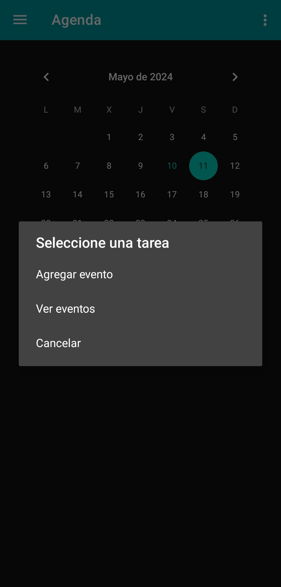

# On Plan

## Deskribapena 📝
On Plan android aplikazio bat da. Aretoak erreserbatzeko aplikazio bat da, data, ordua, edukiera eta aurrekontuaren arabera. Egunero dituzun ekitaldiak ikusi eta editatu ahal izango dituzu, ekitaldiaren ordu bakoitzean dena prest izateko antolatuta egongo diren gauzak jartzeko.

## Instalazioa 🚀
Aplikazioaren APK instalatzeko, "[**Releases**](https://github.com/Aritz-Garcia/OnPlan/releases)" atalean sartu eta nahi den bertsioa deskargatu behar da.

## Galeria 🖼
### Modu argia: ☀

<table>
    <tr>
        <td></td>
        <td></td>
        <td></td>
    </tr>
    <tr>
        <td></td>
        <td></td>
        <td></td>
    </tr>
    <tr>
        <td></td>
        <td></td>
        <td></td>
    </tr>
    <tr>
        <td colspan="3" align="center"></td>
    </tr>
</table>

### Modu iluna: 🌙

<table>
    <tr>
        <td></td>
        <td></td>
        <td></td>
    </tr>
    <tr>
        <td></td>
        <td></td>
        <td></td>
    </tr>
    <tr>
        <td></td>
        <td></td>
        <td></td>
    </tr>
    <tr>
        <td colspan="3" align="center"></td>
    </tr>
</table>

### Bideoa: 🎥
https://github.com/Aritz-Garcia/OnPlan/assets/73273260/2cbee548-0bd0-4f11-8565-c2ec9e67f4dc

## Garatzaileak 👨🏻‍💻
- **Aritz Garcia:** [@Aritz-Garcia](https://github.com/Aritz-Garcia)
- **Oier San Roman:** [@spacecowboy1310](https://github.com/spacecowboy1310)
- **Ager Zabala:** [@Agerzace](https://github.com/Agerzace)
- **Markel Seabrookes:** [@BoilingPower59](https://github.com/BoilingPower59)
